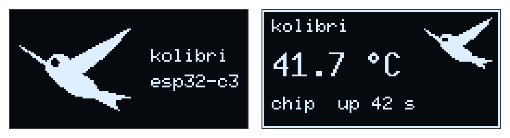

<picture>
  <source media="(prefers-color-scheme: dark)" srcset="assets/kolibri-wordmark-dark.svg">
  
</picture>

Async firmware boilerplate for the **Seeed Studio XIAO ESP32-C3**, built on
[esp-hal](https://github.com/esp-rs/esp-hal) and [Embassy](https://embassy.dev).
Builds on **stable Rust** — no nightly, no `-Z build-std`, no Xtensa toolchain.

*Kolibri* is German for hummingbird — hence the bird, which the firmware also
draws on the OLED.

[](https://github.com/marc/kolibri/actions/workflows/ci.yml)
[](#licence)

The example firmware runs two concurrent Embassy tasks: one blinking an LED on
`D10`, one logging a heartbeat and retuning the blink rate through an
`embassy_sync::Signal`.

---

## Hardware

> **The XIAO ESP32-C3 has no user-controllable onboard LED.** Its two LEDs are a
> hardwired power indicator and a battery-charge indicator — neither is reachable
> from software. Seeed's own Blink example wires an external LED, and so does
> this one.

Wire an LED and a current-limiting resistor between **D10** and **GND**:

```
  GPIO10 (D10) ──────[ 150 Ω ]──────▶|──────  GND
                                    LED
                              (long leg → resistor)
```

**You do not need the LED to check the firmware works.** Every transition is
logged over USB serial, so `cargo run` on a bare board still shows `led on` /
`led off` scrolling past.

### Pin reference

| Silkscreen | GPIO | Notes |
|---|---|---|
| D0–D3 | 2, 3, 4, 5 | ADC-capable. **GPIO2 is a strapping pin.** |
| D4 / D5 | 6, 7 | I²C SDA / SCL — **used for the SH1106 OLED here** |
| D6 / D7 | 21, 20 | UART TX / RX |
| D8 / D9 | 8, 9 | SPI SCK / MISO. **Both are strapping pins** (GPIO9 = BOOT). |
| D10 | 10 | SPI MOSI — **used for the LED here** |

Avoid GPIO2, GPIO8 and GPIO9 for outputs: driving them at reset can put the chip
into the wrong boot mode.

### OLED display

An SH1106 128x64 I²C module wires to `D4` (SDA), `D5` (SCL), `3V3` and `GND`.
Use the module's own pull-ups — the C3's internal ones are ~45 kΩ, too weak for
the 400 kHz the firmware configures. The default address is `0x3C`.

On boot the firmware puts up a two-second splash and then switches to the
status screen. Both are rendered here pixel-for-pixel as the firmware draws
them, from the same font and the same bitmaps:



The bird is the repository logo, rasterised from the same vector master. A
two-colour panel has no grey to model shape with, so the artwork is a
silhouette and the outline has to carry the whole bird.
[`tools/gen-logo.py`](tools/gen-logo.py) renders
[`assets/kolibri.svg`](assets/kolibri.svg) at the two sizes the firmware draws
and writes [`src/logo.rs`](src/logo.rs):

```sh
python3 tools/gen-logo.py   # needs Inkscape and Pillow; rerun after editing the SVG
```

The packing is what `embedded_graphics::image::ImageRaw` expects — one bit per
pixel, rows padded to whole bytes, most significant bit leftmost. A set bit is
a *lit* pixel, so the bird glows against the panel's own black rather than
being punched out of a lit rectangle. Both widths are multiples of eight, so
every row is a whole number of bytes and the generated lines correspond one to
one with display rows. The 40x30 glyph is thresholded fatter than the 64x48
one: at that size the beak is a single pixel wide and a neutral threshold drops
it.

The driver is [`oled_async`](https://crates.io/crates/oled_async), not the more
familiar `ssd1306` crate. The SH1106 has **no horizontal addressing mode**: its
column pointer wraps within the current page rather than advancing to the next
one, so `ssd1306`'s `flush` — which streams all 8 pages back-to-back and relies
on that auto-advance — rewrites page 0 eight times instead of drawing a frame.
`oled_async` re-sends the page and column address per page, and its
`Sh1106_128_64` variant carries the `COLUMN_OFFSET = 2` that the controller's
132-column RAM requires.

---

## Prerequisites

The Rust toolchain and the `riscv32imc-unknown-none-elf` target install
themselves from [`rust-toolchain.toml`](rust-toolchain.toml) the first time you
run a `cargo` command. You only need the flashing tools:

```sh
cargo install espflash --locked        # flash + serial monitor
cargo install probe-rs-tools --locked  # breakpoint debugging (optional)
```

### Linux: USB permissions

The XIAO's USB-C port is wired straight to the ESP32-C3's built-in USB
Serial/JTAG peripheral (there is no CP210x/CH340 bridge). Without a udev rule,
flashing fails with a permission error — this is by far the most common setup
problem.

```sh
sudo tee /etc/udev/rules.d/99-esp32c3.rules >/dev/null <<'EOF'
# Espressif USB JTAG/serial debug unit (ESP32-C3, -C6, -S3, ...)
SUBSYSTEM=="usb", ATTR{idVendor}=="303a", ATTR{idProduct}=="1001", MODE="0666", TAG+="uaccess"
SUBSYSTEM=="tty", ATTRS{idVendor}=="303a", ATTRS{idProduct}=="1001", MODE="0666", TAG+="uaccess"
EOF

sudo udevadm control --reload-rules && sudo udevadm trigger
sudo usermod -aG dialout "$USER"   # then log out and back in
```

Verify the board is seen: `lsusb | grep 303a` should show
`Espressif USB JTAG/serial debug unit`.

---

## Build, flash, run

```sh
cargo build                # debug
cargo build --release      # optimised (opt-level = "s", fat LTO)

cargo run --release        # flash over USB-C and open the serial monitor
```

`cargo run` works because [`.cargo/config.toml`](.cargo/config.toml) sets
`runner = "espflash flash --monitor"`. Expected output:

```
INFO - kolibri starting on XIAO ESP32-C3
INFO - led on
INFO - led off
...
INFO - heartbeat (uptime 5 s)
INFO - blink period -> 100 ms
```

Change the log level per invocation: `ESP_LOG=debug cargo run --release`
(the default, `info`, is baked in via `.cargo/config.toml`).

### If flashing fails to start

espflash resets the chip over USB automatically, but if that ever fails
(a half-bricked image, a flaky cable), force download mode by hand:

1. Hold **BOOT** (the button next to the USB port, GPIO9).
2. Tap **RESET**.
3. Release **BOOT**, then run `cargo run` again.

A cable that only carries power and no data looks exactly like a dead board —
if `lsusb` shows nothing, try another cable before anything else.

---

## Debugging

### Breakpoints (probe-rs, VS Code)

The C3's built-in USB-JTAG means **no external debug probe is needed** — the
same USB-C cable does it. Press **F5** in VS Code and pick
*Debug (probe-rs, built-in USB-JTAG)*; see [`.vscode/launch.json`](.vscode/launch.json).
There is also an *Attach* configuration that connects to already-running
firmware without reflashing or resetting.

> **Only one tool can hold the USB device at a time.** Stop any running
> `cargo run` / espflash monitor before starting a debug session, and vice
> versa. "Probe not found" almost always means a monitor is still attached.

From the command line:

```sh
probe-rs run --chip esp32c3 target/riscv32imc-unknown-none-elf/debug/kolibri
probe-rs info --chip esp32c3
```

The ESP32-C3 has 4 hardware breakpoints. Debug info is kept in release builds
too (`debug = 2`), so release binaries stay steppable — it costs flash nothing,
since debug sections are not loaded onto the device.

### Panics

`esp-backtrace` prints a panic message and a stack trace over the same serial
link. `espflash monitor` resolves the addresses against the ELF automatically,
so a panic looks like real function names rather than raw hex. The
`-C force-frame-pointers` flag in `.cargo/config.toml` is what makes that
unwinding possible — don't remove it.

### Logging

`esp-println` writes plain UTF-8 to the USB Serial/JTAG peripheral, so any
terminal can read it — `espflash monitor`, `screen /dev/ttyACM0 115200`, or the
VS Code terminal. Use `log::{trace,debug,info,warn,error}!` as usual.

---

## Project layout

| Path | What it is |
|---|---|
| [`src/main.rs`](src/main.rs) | Entry point, tasks, and the board constants |
| [`src/logo.rs`](src/logo.rs) | Generated 1-bpp hummingbird bitmaps for the OLED |
| [`assets/`](assets/) | Logo master, wordmarks, and the OLED preview |
| [`tools/gen-logo.py`](tools/gen-logo.py) | Regenerates `src/logo.rs` from the logo master |
| [`.cargo/config.toml`](.cargo/config.toml) | Target, linker flags, `cargo run` runner |
| [`rust-toolchain.toml`](rust-toolchain.toml) | Pinned toolchain + RISC-V target |
| [`deny.toml`](deny.toml) | Dependency licence / advisory policy |
| [`.vscode/`](.vscode/) | Settings, tasks, extensions, debug configs |
| [`.github/workflows/ci.yml`](.github/workflows/ci.yml) | fmt, clippy, build, image, cargo-deny |

### Changing the LED pin or blink rate

Both live at the top of [`src/main.rs`](src/main.rs): `BLINK_PERIOD`,
`BLINK_PERIOD_FAST`, `HEARTBEAT_PERIOD`, and the `peripherals.GPIO10` argument
to `Output::new` in `main`.

---

## Crate versions

These are a **matched set** — `esp-rtos` 0.4 requires `esp-hal` ~1.2 and
`embassy-sync` ^0.8. Bumping one alone will not resolve.

| Crate | Version |
|---|---|
| `esp-hal` | 1.2 |
| `esp-rtos` | 0.4 |
| `esp-bootloader-esp-idf` | 0.6 |
| `esp-println` / `esp-backtrace` | 0.18 / 0.20 |
| `embassy-executor` / `-time` / `-sync` | 0.10 / 0.5 / 0.8 |

> **Note on `esp-hal-embassy`:** it no longer exists. As of esp-hal 1.2 the
> Embassy time driver and executor moved into **`esp-rtos`** (`embassy` feature),
> and `#[esp_hal::main] async fn main(spawner: Spawner)` expands into an
> `esp_rtos::embassy::Executor`. Most tutorials and templates online still use
> the old crate and will not compile against esp-hal 1.2.

---

## CI

[`.github/workflows/ci.yml`](.github/workflows/ci.yml) runs on every push and PR:
`cargo fmt --check`, `cargo clippy -D warnings`, a release build, and
`cargo-deny` (advisories, licences, bans, sources). It uploads a flashable
`firmware.bin` (bootloader + partition table + app, ~190 KB) as a build artifact:

```sh
espflash write-bin 0x0 firmware.bin   # flash a CI artifact directly
```

Dependabot proposes weekly `cargo` and `github-actions` updates, grouped so the
esp-rs and Embassy crates move together.

---

## Getting this onto a remote

The repo is initialised locally with no remote configured:

```sh
git remote add origin git@github.com:<you>/kolibri.git
git push -u origin main
```

Update the `repository` field in [`Cargo.toml`](Cargo.toml) and the badge URLs
above to match.

---

## Contributing

See [CONTRIBUTING.md](CONTRIBUTING.md). The short version: `cargo fmt`,
`cargo clippy -D warnings`, and flash it to a real board before opening a PR.

## Licence

Licensed under the Apache License, Version 2.0
([LICENSE-APACHE](LICENSE-APACHE)).
