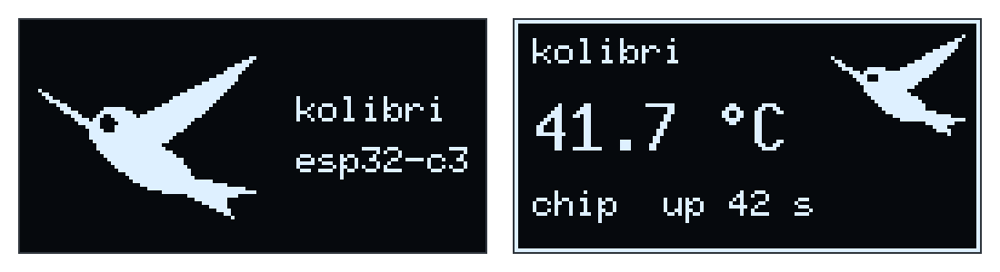

<picture>
  <source media="(prefers-color-scheme: dark)" srcset="assets/kolibri-wordmark-dark.svg">
  
</picture>

Async firmware boilerplate for the **Seeed Studio XIAO ESP32-C3**, built on
[esp-hal](https://github.com/esp-rs/esp-hal) and [Embassy](https://embassy.dev),
on **stable Rust**. The application lives in a HAL-independent crate, so a new
MCU means a new board crate, not a rewrite — see [`boards/README.md`](boards/README.md).
*Kolibri* is German for hummingbird.

[](https://github.com/marc/kolibri/actions/workflows/ci.yml)
[](#licence)

Four Embassy tasks run concurrently: temperature sampling, the OLED screen, an
LED blinker on `D10`, and a heartbeat that retunes the blink rate through a
`Signal`.

```
kolibri-core/          portable: task loops, screen, sensor trait, flash storage
boards/xiao-esp32c3/   chip-specific: esp-hal, entry point, pins, sensor
```

## Hardware

The XIAO ESP32-C3 has **no user-controllable onboard LED**, so wire one with a
resistor between **D10** and **GND**. The LED is optional: every transition is
also logged over USB serial.

```
  GPIO10 (D10) ──────[ 150 Ω ]──────▶|──────  GND
```

| Silkscreen | GPIO | Notes |
|---|---|---|
| D0–D3 | 2, 3, 4, 5 | ADC. **GPIO2 is a strapping pin.** |
| D4 / D5 | 6, 7 | I²C SDA / SCL — **SH1106 OLED** |
| D6 / D7 | 21, 20 | UART TX / RX |
| D8 / D9 | 8, 9 | SPI SCK / MISO. **Strapping pins** (GPIO9 = BOOT). |
| D10 | 10 | SPI MOSI — **LED** |

Avoid GPIO2, 8 and 9 for outputs; driving them at reset can select the wrong boot mode.

**OLED:** an SH1106 128x64 I²C module on `D4`/`D5`, `3V3`, `GND`, address
`0x3C`. Use the module's own pull-ups; the C3's internal ones are too weak for
400 kHz. The firmware shows a two-second splash, then the status screen:



The image is rendered from the real fonts, bitmaps and coordinates by
[`tools/gen-oled-preview.py`](tools/gen-oled-preview.py); the bitmaps come from
[`assets/kolibri.svg`](assets/kolibri.svg) via [`tools/gen-logo.py`](tools/gen-logo.py).
Rerun them after changing the layout or the logo.

## Prerequisites

The toolchain and target install themselves from
[`rust-toolchain.toml`](rust-toolchain.toml). You only need the flashing tools:

```sh
cargo install espflash --locked        # flash + serial monitor
cargo install probe-rs-tools --locked  # debugging (optional)
```

**Linux:** the board uses the C3's native USB Serial/JTAG, which needs a udev rule:

```sh
sudo tee /etc/udev/rules.d/99-esp32c3.rules >/dev/null <<'EOF'
SUBSYSTEM=="usb", ATTR{idVendor}=="303a", ATTR{idProduct}=="1001", MODE="0666", TAG+="uaccess"
SUBSYSTEM=="tty", ATTRS{idVendor}=="303a", ATTRS{idProduct}=="1001", MODE="0666", TAG+="uaccess"
EOF
sudo udevadm control --reload-rules && sudo udevadm trigger
sudo usermod -aG dialout "$USER"   # then log out and back in
```

`lsusb | grep 303a` should show `Espressif USB JTAG/serial debug unit`.

## Build, flash, run

Build from **inside the board directory** so its `.cargo/config.toml` applies:

```sh
cd boards/xiao-esp32c3
cargo build --release
cargo run --release        # flash over USB-C and open the serial monitor
```

A bare `cargo build` at the repository root builds only `kolibri-core` for the
host, which checks that it stays portable. Expected output:

```
INFO - kolibri starting on XIAO ESP32-C3
INFO - boot #7
INFO - display on 0x3c
INFO - display ready
INFO - chip temperature 41.7 C
INFO - led on
INFO - heartbeat (uptime 5 s)
INFO - blink period -> 100 ms
```

Change the log level with `ESP_LOG=debug cargo run --release`.

**If flashing fails:** hold **BOOT**, tap **RESET**, release **BOOT**, and retry.
If `lsusb` shows nothing, try another cable; charge-only cables are common.

## Debugging

- **Breakpoints:** press **F5** in VS Code (probe-rs over the built-in USB-JTAG,
  no probe needed; see [`.vscode/launch.json`](.vscode/launch.json)), or
  `probe-rs run --chip esp32c3 target/riscv32imc-unknown-none-elf/debug/kolibri`.
  Release builds keep debug info too.
- **Only one tool can hold the USB device.** Stop `cargo run`/espflash before
  debugging; "probe not found" usually means a monitor is still attached.
- **Panics:** `esp-backtrace` prints a stack trace that `espflash monitor`
  symbolises. This needs `-C force-frame-pointers` in `.cargo/config.toml`.

## Project layout

| Path | What it is |
|---|---|
| [`kolibri-core/src/`](kolibri-core/src/) | Portable crate: `blink`, `heartbeat`, `temperature`, `display`, `storage`, generated `logo` |
| [`boards/xiao-esp32c3/src/main.rs`](boards/xiao-esp32c3/src/main.rs) | Entry point, pin map, on-chip sensor, tasks |
| [`boards/README.md`](boards/README.md) | How to add a board |
| [`tools/`](tools/) | Logo/preview generators, settings provisioning, firmware size report |
| [`.github/workflows/ci.yml`](.github/workflows/ci.yml) | fmt, clippy, tests, per-board build, size report, cargo-deny |

## Customising

- **Pins and addresses** are board facts, at the top of
  [`main.rs`](boards/xiao-esp32c3/src/main.rs): `DISPLAY_ADDRESS`,
  `I2C_FREQUENCY`, and the GPIOs passed in `main`.
- **Timings** are application policy in `kolibri-core`: `blink::PERIOD`,
  `heartbeat::PERIOD`, `display::PERIOD`, `temperature::PERIOD`, etc.
- **Temperature source:** the on-chip sensor measures the die, typically
  10–20 °C above the room, hence the `chip` label. For ambient readings, add an
  I²C sensor (SHT4x, BME280, AHT20) on the same bus, implement
  `kolibri_core::temperature::Source` for it, and point the board's `Sensor`
  alias at it. Sharing the bus with the display needs an `embassy_sync` mutex.
- **Dependencies:** the esp-rs crates are a matched set; bump them together.

## Settings storage

`kolibri_core::storage` keeps one small record in flash that survives resets,
power loss and reflashes. For now it holds a boot counter; Wi-Fi credentials
come next. It alternates between two slots and writes the checksummed header
last, so an interrupted save keeps the previous record.

The record lives in espflash's default `nvs` partition (`0x9000`, 24 KiB).
Wipe it with `espflash erase-region 0x9000 0x6000`.

[`tools/mk-settings.py`](tools/mk-settings.py) builds and inspects records on the
host. It parses the format from `storage.rs`, and a unit test checks the two agree:

```sh
python3 tools/mk-settings.py --boot-count 41     # writes settings.bin
espflash write-bin 0x9000 settings.bin           # or add --flash

espflash read-flash 0x9000 0x2000 dump.bin
python3 tools/mk-settings.py --inspect dump.bin
```

## CI

Every push and PR runs fmt, clippy and tests on `kolibri-core` for the host,
then clippy and a release build per board, plus `cargo-deny`. Each board
uploads a flashable `firmware.bin` (`espflash write-bin 0x0 firmware.bin`) and
a flash/SRAM size report. On PRs the report is posted as a comment with the
change against the latest `main` baseline. Run it locally:

```sh
python3 tools/fw-size.py target/riscv32imc-unknown-none-elf/release/kolibri \
    --chip esp32c3 [--json before.json | --baseline before.json]
```

Dependabot proposes weekly `cargo` and `github-actions` updates.

## Contributing

See [CONTRIBUTING.md](CONTRIBUTING.md): `cargo fmt`, `cargo clippy -D warnings`
on the core and on the board, and test on real hardware before opening a PR.

## Licence

Licensed under the Apache License, Version 2.0 ([LICENSE-APACHE](LICENSE-APACHE)).
